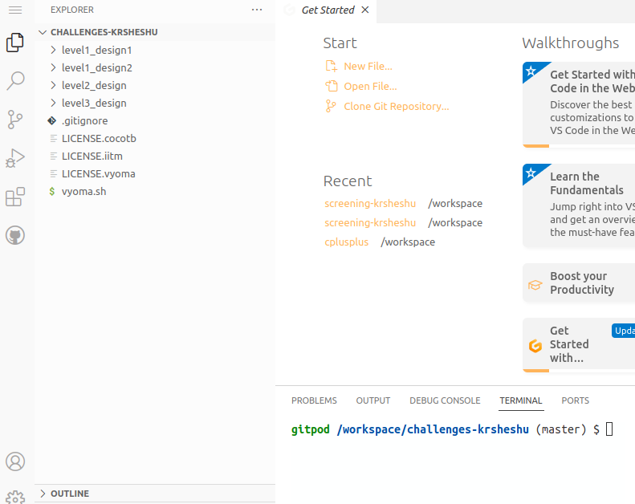
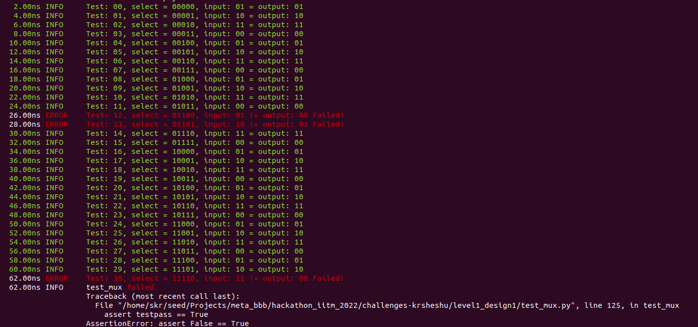
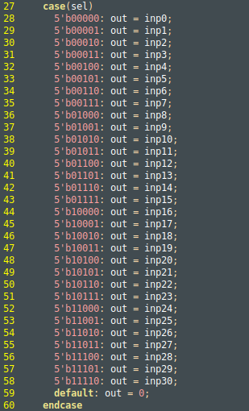
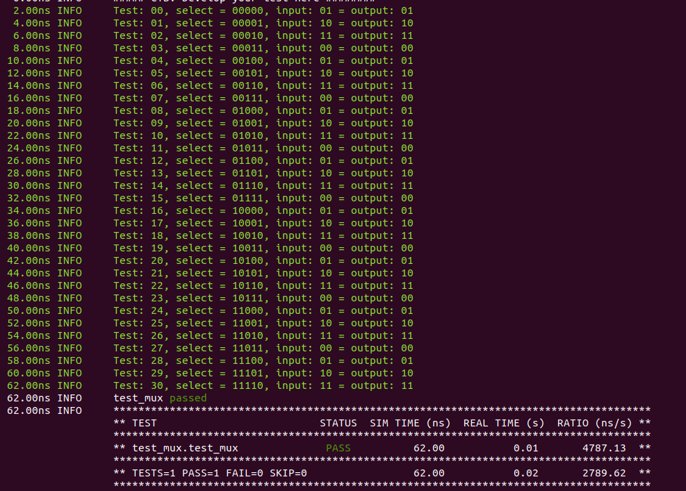

# Level1_Design1 Design Verification

1)The verification environment is setup using [Vyoma's UpTickPro](https://vyomasystems.com) provided for the hackathon.

.

## Verification Environment

The [CoCoTb](https://www.cocotb.org/) based Python test is developed as explained.
1) The test drives the whole 31 select combinations ( 0 upto 31 ) on the select lines of the mux
2) Inputs from 0 to 30 are driven by a repeating sequence of 0 upto 3 on sucesive input lines
3) For every select input a reference output value is calculated based on the driven input signal
4) This reference value is then compared with the module output ( *dut.out.value* ) in the test bench and error scenarios are displayed
5) A corrected design is available in the folder corrected_design and a makefile is available which runs the same testbench, but now with corrected DUT.

## Test Scenario **(Important)**

1) The test scenarios can be seen from the test cases from the below image
.
2) 3 Failed scenarios are displaed in *red*
3) These are select = 01100,01101 and 11110

## Design Bug

1) The error is due to implementation bug for the above mentioned select inputs
2) The corrected design looks like below

.

3) After correcttion the test results looks like below

.

## Verification Strategy

1) The verification strategy was to run the whole test cases one after another and to check the DUT output with reference expected outputs

## Is the verification complete ?

1) The verification is almost complete as we run all select states with this test case
2) All input state spaces are not checked as we assume there is no input word compression inside the DUT
