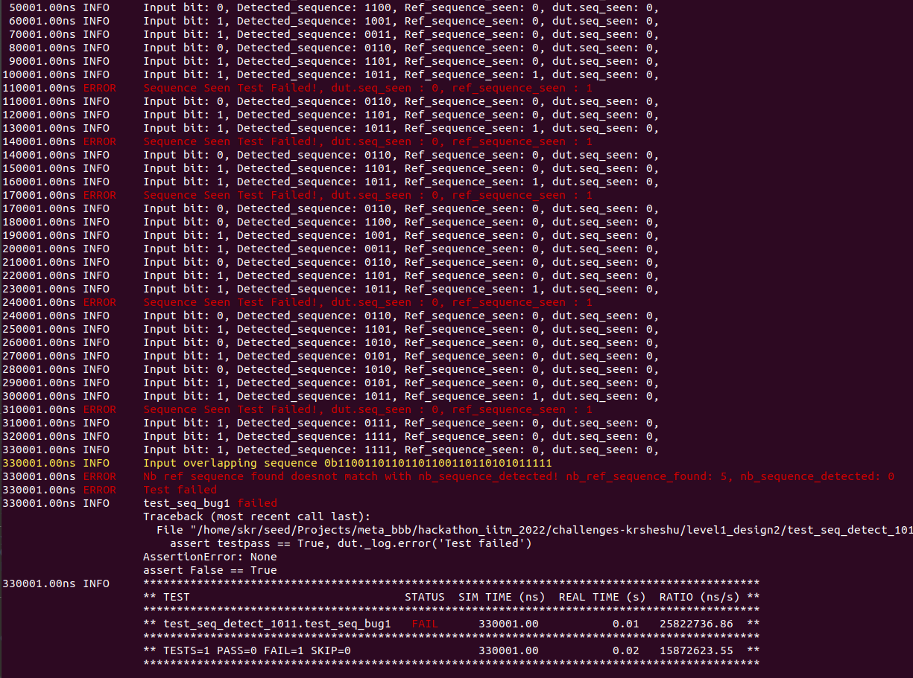
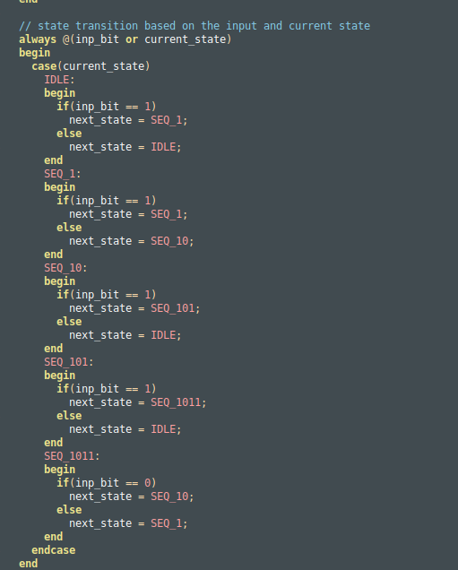
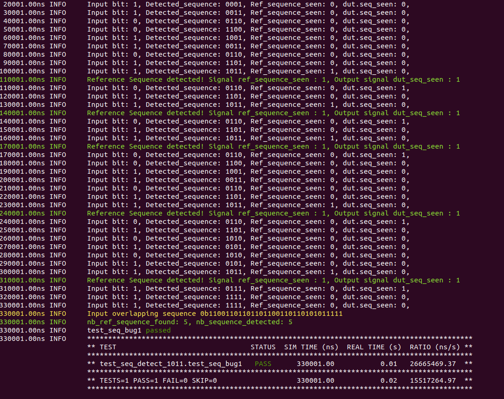

# Level1_Design2 Design Verification

1)The verification environment is setup using [Vyoma's UpTickPro](https://vyomasystems.com) provided for the hackathon.

.

## Verification Environment

The [CoCoTb](https://www.cocotb.org/) based Python test is developed as explained.
1) The test generates a clock drives the DUT.
2) The active HIGH reset signal is asserted and deasserted for one clock from the tb and the design is ready for input sequence
3) A multi overlapping sequence *0b11001101101101100110110101011111* is driven onto the inp_bit signal on every rising edge of the clock
4) A reference sequence detector is running inside the testbench which according to the shifted input bits to the DUT, calculates if there is a sequence detected on the input.
5) The seq_seen pin of DUT is probed parallely with the reference sequence detected signal in the tb and if it doesn't match an error condition is notified
6) A corrected design is available in the folder corrected_design and a makefile is available which runs the same testbench, but now with corrected DUT.

## Test Scenario **(Important)**

1) The test scenarios can be seen from the test cases from the below image
.
2) 5 Failed scenarios are displayed in *red*
3) The input multi overlapping sequence is also displayed in yellow

## Design Bug

1) The error is due to a wrongly implemented statemachine. This skips overlapping sequences
2) The corrected statemachine looks like below

.

3) After correcttion the test results looks like below

.

## Verification Strategy

1) The verification strategy was to introduce an input multi overlapping sequence with some corner case scenarios
2) the testbench logic detects the sequence parallelly with the DUT and the sequence detection results are compared

## Is the verification complete ?

1) The verification is almost complete as we run multi overlapping sequence test scenario on the inputs
2) Corner cases are assessed and a well thought test scenario is developed
