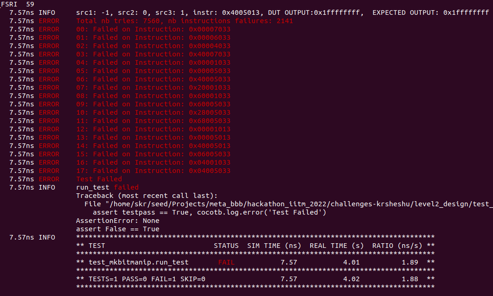

# Level1_Design2 Design Verification

1)The verification environment is setup using [Vyoma's UpTickPro](https://vyomasystems.com) provided for the hackathon.

.

## Verification Environment

The [CoCoTb](https://www.cocotb.org/) based Python test is developed as explained.
1) A Class Bitmanip_Instructions ( file: *bitmanip_instructions.py* ) is developed which encapsulates all the instructions are per the specifications
2) An object of the above class is instantiated in the testbench which can then use any kind of instruction for the tests as per the requirement.
3) A carefully choosen stimulus set is generated looking at corner cases which consists of 7 inputs
4) From this 7 input set all the permutations of 3 inputs are choosen as final test vectors for coprocessor registers in the testbench
5) This choice adds up to 7560 test cases which are then passed to the DUT as well as to the reference model
7) The output from the reference model is then compared with the DUT outputs and the error instructions are displayed

## Test Scenario **(Important)**

1) The final error instructios can be seen from the below image
.
2) The *18* failed instructions are displayed in *red*

## Design Bug

1) Mmany instructions fail due to error in implementations
2) Some instructions looks like not even implemented by the co-processor

## Verification Strategy

1) The verification strategy was to carefully choose corner case scenarios by selecting corener case register values and its permutations and running every instruction to compute all the permuations
2) Thee good choice of register values could save simulation time and 18 error instructions are detected within 4.02 seconds of simulation run.

## Is the verification complete ?

1) The verification is not complete as we run only the corner case input scenarios and its permutations to save sinulation time
2) Carefully choosing the corner cases seems to win over randomized selection as we are more likely to hit error scenarios owing to a very exhaustive random vectors in 32 bit input register ranges
3) Considerable simulation time is saved by not using random vectors. Current simulation detects error in 18 instructions withn 4s.
