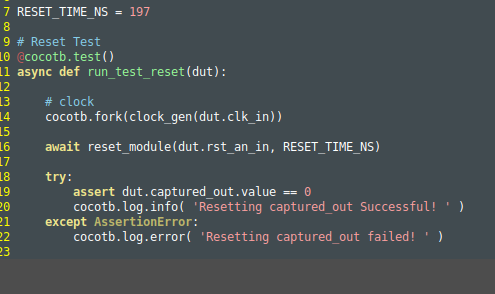
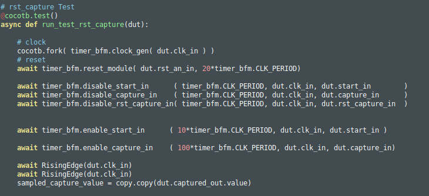
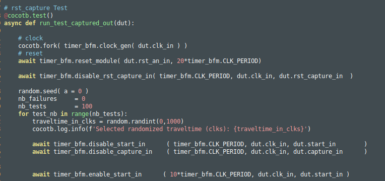
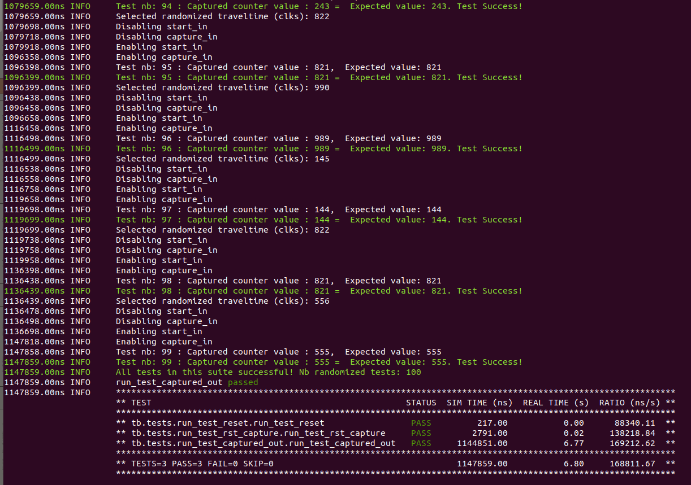
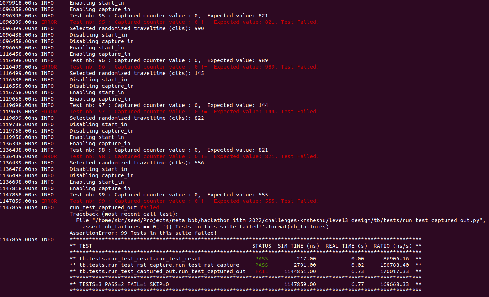

# Level1_Design2 Design Verification

1)The verification environment is setup using [Vyoma's UpTickPro](https://vyomasystems.com) provided for the hackathon.

.

## Verification Environment

The [CoCoTb](https://www.cocotb.org/) based Python test is developed as explained.
1) Three test suits are created for testing the complete Tiem of Flight timer design
2) The first test suit tests the reset condition for the outputs ( shown below )

.

3) The second test shown bellow tests the rst_capture signal input to make sure that the output counter value is reset

.

4) The third test shown below is the real datapath test which captures the ToF timer output bus and compares it with the reference timer generated inside the testbench

.

5) The testbench comprises of reference timer values generated randomly from a range of 0 to 1000
6) The test bench also generates the signals start_in and capture_in corresponding to the reference timer values and drives the DUT.
7) The output captured at the capture_out signal of the DUT is then compared with the reference timer values and the results are logged.
8) An error design is also created which fails the same test case.

## Test Scenario **(Important)**

1) The final testbench results according to the generated scenarios mentioned above can be seen from the below image

.

2) 100 Test cases are run for the third design suits which verifies the real ToF functionality with randomly choosen reference timer depths

## Design Bug

1) An error is introduced into the design and is available in the folder error_design
2) The error design uses exactly the same testbench and runs the same test cases.
3) The results can be seen below

.

## Verification Strategy

1) The verification strategy was to randomly select 100 timer values in the range (0, 1000) int the testbench and use it as reference value to drive the DUT
2) The output results from the DUT ( captured_out ) signal is then compared with the timer reference and errors are logged if any

## Is the verification complete ?

1) Full state apace is not checked as it is very exhaustive with 32 bit timer values
2) A randomized test methodology is choosen to verify as many statespaces in the range (0, 1000) for the design to save time and to increase confidence

